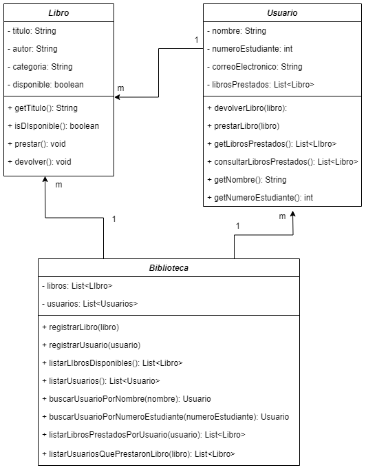
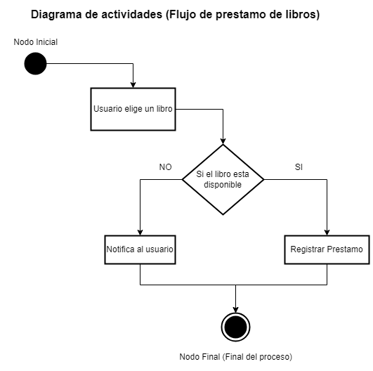

# Defensa del Proyecto de Programación Orientada a Objetos

## Resumen del Proyecto

El proyecto consiste en un Sistema de Gestión de Biblioteca desarrollado utilizando programación orientada a objetos (POO). El sistema permite a los usuarios, en su mayoría estudiantes, llevar a cabo una variedad de tareas relacionadas con la gestión de libros y usuarios en una biblioteca. A continuación, se detallan los aspectos clave del proyecto.

## Descripción del Sistema

El sistema se compone de las siguientes clases principales:

- `Libro`: Representa la información de un libro en la biblioteca. Contiene atributos como título, autor, categoría y disponibilidad. Los métodos incluyen la capacidad de prestar y devolver libros.

- `Usuario`: Representa a los usuarios de la biblioteca, con atributos como nombre, número de estudiante, correo electrónico y una lista de libros prestados. Los usuarios pueden prestar y devolver libros.

- `Biblioteca`: Representa la biblioteca en sí, manteniendo listas de libros y usuarios registrados. Permite registrar libros y usuarios, listar libros disponibles, y buscar usuarios por nombre y número de estudiante.

## Diagrama de Clases y Relaciones

El diagrama de clases UML ilustra las relaciones clave entre las clases del sistema:

- **Biblioteca y Libro**: La biblioteca contiene varios libros, y un libro pertenece a una biblioteca.

- **Usuario y Libro**: Un usuario puede tener varios libros prestados, y un libro es prestado por un usuario.

- **Biblioteca y Usuario**: La biblioteca registra varios usuarios, y un usuario es registrado por una biblioteca.

## Diagramas de Actividades

### Diagrama de Actividad de el Prestamo de Libros

- **1. Inicio del proceso:** Inicia el proceso de prestamos de libros

- **2. Verificar disponibilidad:** Se verifica si el libro esta disponible. Si el libro está disponible, se procede al paso 4. Si el libro no está disponible, se notifica al usuario y se finaliza el proceso.

- **3. Usuario elige un libro:** El usuario elige un libro de la lista de libros disponibles.

- **4. Registrar prestamo:** El libro se marca como prestado. Se registra el préstamo en la cuenta del usuario. Se actualiza la lista de libros prestados por el usuario.

- **5. Fin del proceso:** El proceso de prestamos de libros se completa.

### Diagrama de Actividad de la devolucion de libros

- **1. Inicio del proceso:** Inicia el proceso de devolución de libros.

- **2. Usuario elige un libro a devolver:** El usuario selecciona un libro de la lista de libros que ha prestado.

- **3. Verificar libro a devolver:** Se verifica si el libro seleccionado es válido para devolver. Si es válido, se procede al paso 4. Si no es válido (por ejemplo, el usuario no prestó ese libro), se notifica al usuario y se finaliza el proceso.

- **4. Registrar devolución:** El libro se marca como disponible. Se registra la devolución en la cuenta del usuario. Se actualiza la lista de libros prestados por el usuario.

- **5. Fin del proceso:** El proceso de prestamos de libros se completa.

## Diagramas de casos de uso:

- **Actores:** "Usuario"
- **Casos de uso:**

- **1.1 Gestion de libros:**
    * Registrar Libros
    * Listar Libros Disponibles
    * Buscar Libros

- **1.2 Gestion de Usuarios:**
    * Registrar Usuarios
    * Buscar Usuarios por Nombre
    * Buscar Usuarios por Número de Estudiante

- **1.3 Prestamo y Devolucion de Libros:**
    * Proceso de Prestamo de Libros
    * Proceso de Devolución de Libros

- **1.4 Consultas:**
    * Listar Libros Prestados por un Usuario
    * Listar Usuarios que han Prestado un Libro

- **1.5 Listado General:**
    * Listar Todos los Libros Disponibles
    * Listar Todos los Usuarios Registrados

## Operaciones y Flujo de Trabajo

Las operaciones clave incluyen prestamo y devolucion de libros, que se han implementado en el codigo. El flujo de trabajo se puede visualizar en diagramas de actividad en el codigo fuente.

## Ampliación y Flexibilidad

El diseño del sistema es escalable y flexible, lo que permite futuras expansiones y adiciones de características. Por ejemplo, podrían agregarse funciones de gestión de multas o búsqueda avanzada de libros.

## Calidad del Código

Se ha enfocado en la legibilidad, mantenimiento y eficiencia del código, siguiendo las mejores prácticas de POO. El código está organizado en clases para facilitar la comprensión y colaboración en el desarrollo.

## Ejemplos de Uso y Pruebas

Se han proporcionado ejemplos concretos de cómo se utiliza el sistema en la práctica. Los casos de prueba se han ejecutado para demostrar la funcionalidad correcta.

## Beneficios y Aplicabilidad

El sistema es beneficioso para la gestión de libros y usuarios en bibliotecas educativas. Puede aplicarse en bibliotecas universitarias, instituciones educativas y otros contextos similares.

## Información Adicional

### Alumnos
- **Jeremias R. Guzman**
- **Facundo Zottoli**

### Detalles del Proyecto
- **Lenguaje de Programación:** Java
- **Materia:** Algoritmos y Paradigmas 2023
- **Universidad:** UNSTA (Universidad del Norte Santo Tomás de Aquino)

### Herramientas Utilizadas
- **Editor de Código:** Visual Studio Code
- **Editor del Diagrama de Clases:** draw.io

